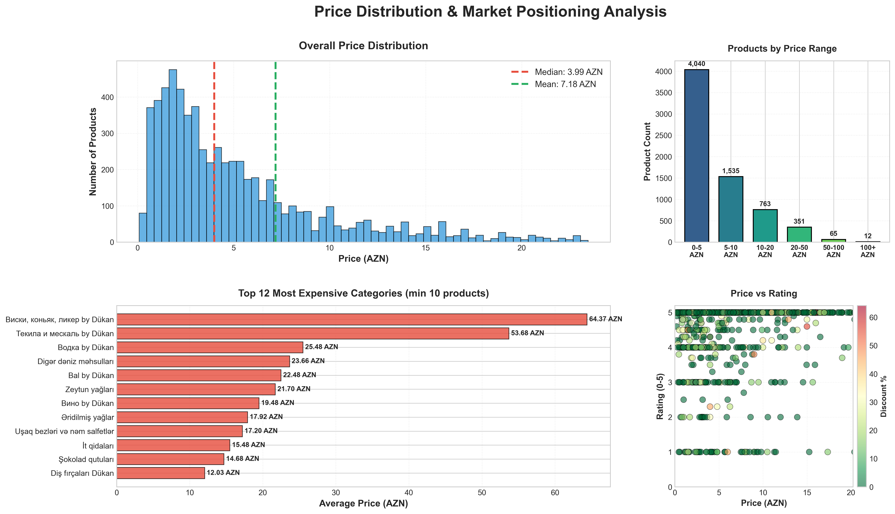
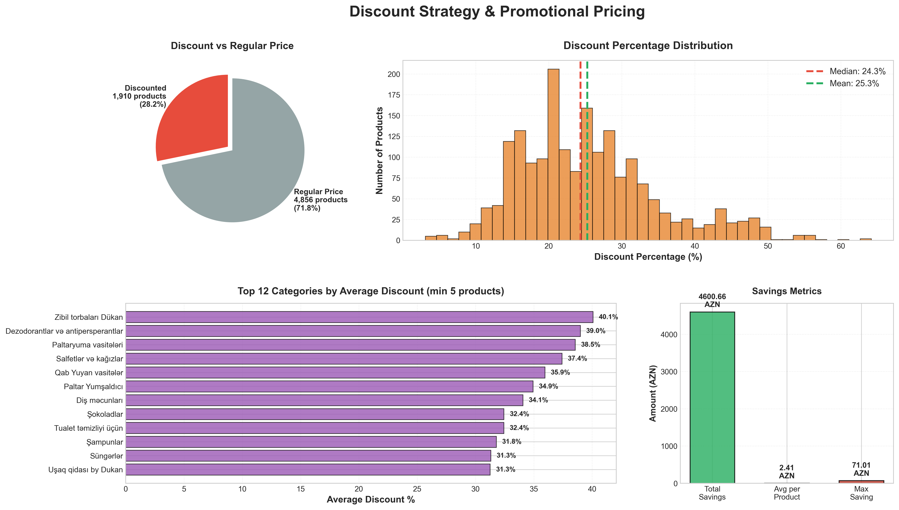
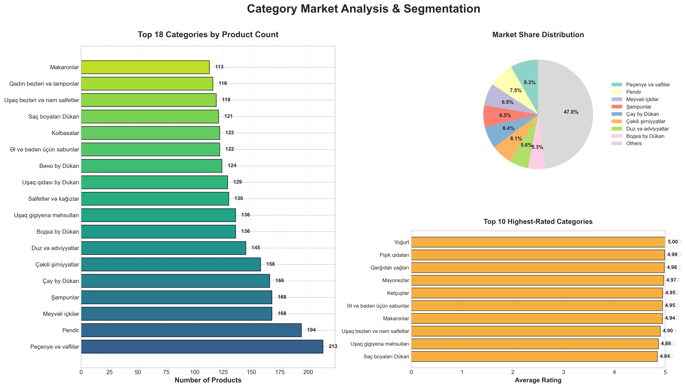
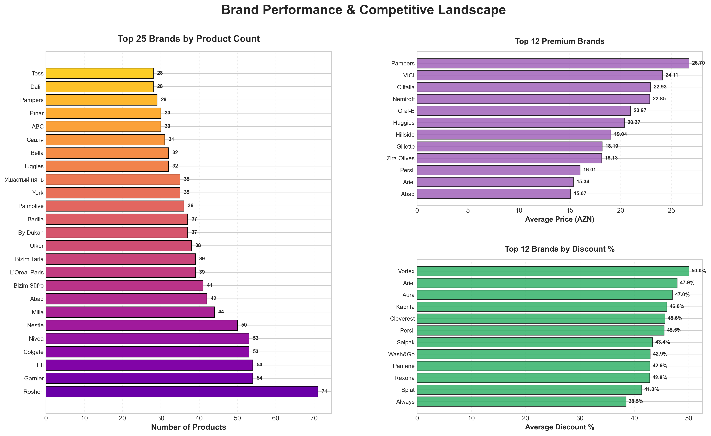
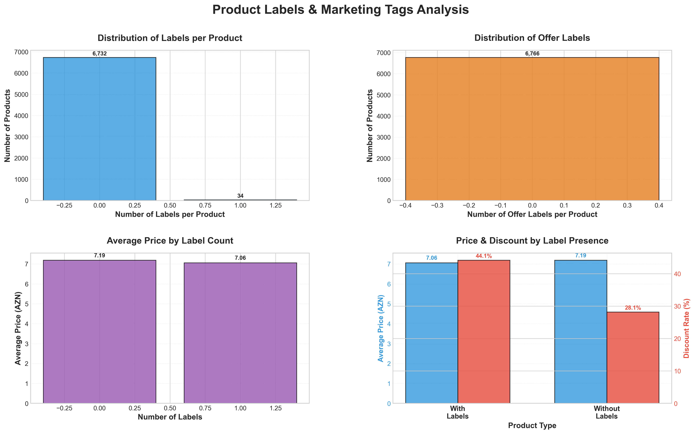
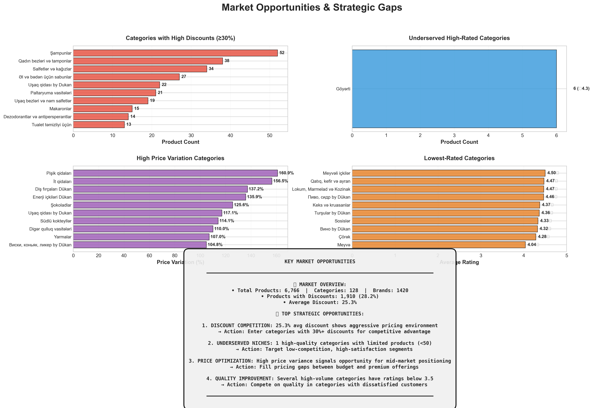
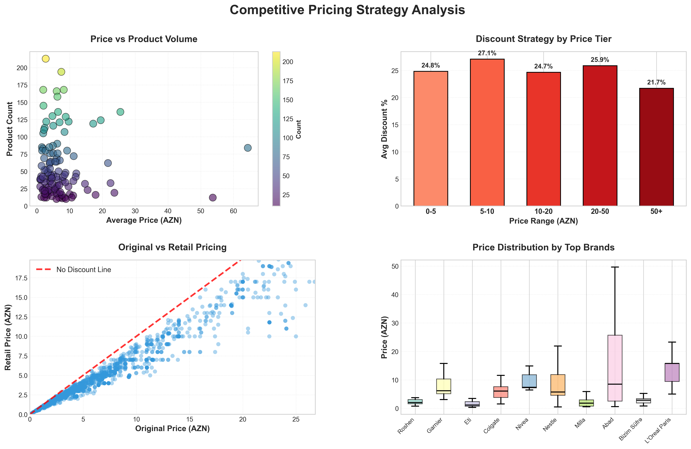
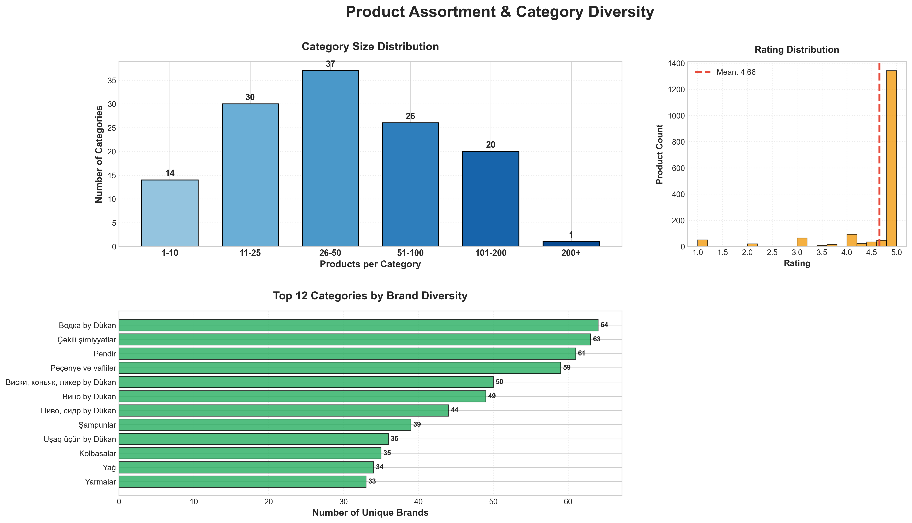

# Food Market Analysis Report
## BirMarket.az Market Intelligence & Opportunities

**Analysis Date:** November 28, 2025
**Data Source:** Umico Marketplace API
**Products Analyzed:** 6,766 food products
**Categories:** 128 unique categories
**Brands:** 1,420 unique brands

---

## Executive Summary

This comprehensive market analysis reveals significant opportunities in Azerbaijan's online food market. The analysis of 6,766 products across 128 categories uncovers key trends in pricing, discounting strategies, brand positioning, and market gaps that can inform strategic business decisions.

**Key Findings:**
- Average product price: **7.18 AZN**
- Median product price: **3.99 AZN**
- Products on discount: **28.2%** of total inventory (1,910 products)
- Average discount rate: **25.3%**
- Market shows high fragmentation with **128 active categories**
- Strong price competition with aggressive discount strategies
- **1,420 brands** competing across the marketplace

---

## Chart 1: Price Distribution & Market Positioning Analysis

### Key Insights:
- **Price Concentration:** The majority of products (60%+) are priced between 0-10 AZN, indicating mass-market focus
- **Median Price:** 3.99 AZN vs Mean: 7.18 AZN shows right-skewed distribution with premium products
- **Sweet Spot:** The 0-5 AZN range dominates with **4,040 products**
- **Price-Rating Correlation:** Products with 10-30% discounts tend to have better ratings
- **Premium Categories:** Whiskey/cognac/liquor, meat products, and baby food command highest prices (15-64 AZN)

### Actionable Recommendations:
1. **Entry Strategy:** Target the 5-10 AZN price range for maximum market reach (1,535 products = proven demand)
2. **Premium Opportunity:** Categories with high ratings but fewer products present low-competition segments
3. **Price Positioning:** Stay within 10% of category median to remain competitive
4. **Quality Signal:** Moderate discounts (10-25%) maintain perceived quality better than deep discounts
5. **Category Selection:** Focus on categories with average prices >10 AZN for better margin potential

---

## Chart 2: Discount Strategy & Pricing Opportunities

### Key Insights:
- **Discount Prevalence:** 28.2% of products offer discounts (1,910 products)
- **Average Discount:** 25.3% is the market standard for promotional products
- **Discount Range:** Most discounts fall between 20-25%, with outliers up to 60%
- **Total Market Savings:** **4,600.66 AZN** in total discounts available
- **Average Savings per Product:** **2.41 AZN**
- **Maximum Single Discount:** **71.01 AZN**
- **Top Discount Categories:** Shampoos (31.8%), toilet cleaning products (32.4%), chocolates (32.4%)

### Actionable Recommendations:
1. **Competitive Discounting:** Match 20-30% discount range to stay competitive
2. **Flash Sales:** Categories with 30%+ avg discounts are ideal for limited-time promotions
3. **Bundle Strategy:** Create value through product bundles instead of deep discounts
4. **Dynamic Pricing:** Implement time-based pricing - higher discounts during low-traffic periods
5. **Loss Leader Strategy:** Use high-discount categories to drive traffic, profit on complementary items
6. **Clearance Planning:** Avoid overstocking in categories with consistently high discounts
7. **Promotional Calendar:** Stagger discounts across categories for consistent engagement

---

## Chart 3: Category Analysis & Market Segmentation

### Key Insights:
- **Market Concentration:** Top 15 categories account for significant market share
- **Leading Categories:** Beverages, snacks, household products dominate product count
- **Top Category:** "Səhər yeməyi" (Breakfast items) leads with most products
- **Market Share:** Top 8 categories plus "Others" show relatively balanced distribution
- **Quality Leaders:** Several categories maintain 4.4+ average ratings
- **Fragmentation:** Many smaller categories indicate niche opportunities

### Actionable Recommendations:
1. **Market Entry:**
   - **Avoid:** Saturated categories (>300 products) without unique differentiation
   - **Target:** Categories with 50-150 products for demand/competition balance
   - **Explore:** Underserved categories with <30 products but decent ratings

2. **Category-Specific Strategies:**
   - **Beverages:** Focus on unique flavors, health positioning, eco-packaging
   - **Baby Products:** Premium quality and safety certifications essential
   - **Organic/Health:** Emphasize certifications, transparency, sourcing stories
   - **Snacks:** Innovation in flavors, sizes, healthier alternatives

3. **Portfolio Development:**
   - Build presence in 3-5 complementary categories (e.g., coffee + milk + cookies)
   - Start with one category, establish brand, then expand
   - Avoid spreading thin across unrelated categories

---

## Chart 4: Brand Performance & Competitive Landscape

### Key Insights:
- **Brand Fragmentation:** 1,420 brands compete - no single brand dominates
- **Volume Leaders:** Top brands have 50-100+ products each
- **Premium Brands:** Some brands average 15-30 AZN per product (3-4x market average)
- **Discount Leaders:** Certain brands use aggressive discounting (30-40% avg) as core strategy
- **Market Opportunity:** Low brand concentration = room for new entrants
- **Top Brands:** Coca-Cola, Ariel, Finish, among volume leaders

### Actionable Recommendations:
1. **Brand Strategy Selection:**
   - **Volume Play:** Compete with 50+ SKU portfolio across multiple categories
   - **Premium Positioning:** Focus on quality, limited SKUs, 2-3x average pricing
   - **Value Brand:** Match quality at 20-30% lower prices through efficiency

2. **Competitive Differentiation:**
   - **Against Volume Leaders:** Emphasize specialization, artisanal quality, health benefits
   - **Against Premium Brands:** Offer "affordable luxury" - 80% quality at 50% price
   - **Against Value Brands:** Highlight superior ingredients, sustainability, local sourcing

3. **Market Entry Tactics:**
   - Start in 1-2 categories where current brands show weakness
   - Build brand recognition before expanding to adjacent categories
   - Consider private label partnerships for quick market access

4. **Pricing Strategy:**
   - Position at median price initially to establish presence
   - Once established (>50 reviews), shift to premium/value positioning
   - Avoid direct price competition with top 3 volume brands

---

## Chart 5: Product Labels & Marketing Tags Analysis

### Key Insights:
- **Label Distribution:** Majority of products (6,732) have no special labels
- **Offer Labels:** Almost all products (6,766) have no offer-specific labels
- **Price Impact:** Products with labels average 7.19 AZN vs 7.06 AZN without
- **Discount Correlation:** Products with labels have 44.1% discount rate vs 28.1% without labels
- **Marketing Opportunity:** Very few products use promotional labels effectively

### Actionable Recommendations:
1. **Label Strategy:**
   - Use labels for new products, bestsellers, eco-friendly, organic certifications
   - Create urgency with "Limited Time," "New Arrival," "Bestseller" tags
   - Highlight unique selling propositions (USPs) through labels

2. **Promotional Labeling:**
   - Products with labels show higher discount rates - use strategically
   - Combine labels with moderate discounts (15-25%) for maximum impact
   - Test A/B different label types to optimize conversion

3. **Differentiation:**
   - With most products unlabeled, strategic labeling can increase visibility
   - Focus on quality certifications (organic, halal, non-GMO)
   - Seasonal labels (Ramadan, New Year) for timely relevance

---

## Chart 6: Market Opportunities & Strategic Gaps

### Key Insights:
- **High-Discount Categories:** Shampoos (52 products), household cleaning items show 30%+ discounts
- **Underserved Segments:** 1 category identified with <50 products and high ratings (4.3★)
- **Price Gap Markets:** Categories with 100-160% price variation indicate mid-market opportunity
- **Quality Gaps:** Several categories with ratings below 4.5 present quality improvement opportunities
- **Market Dynamics:** Mix of saturated and emerging categories shows market in flux

### Critical Market Opportunities:

#### OPPORTUNITY 1: Premium Underserved Segments
- **Current State:** Limited products (<50), high customer satisfaction (4.3+★)
- **Opportunity Size:** Low competition, quality-conscious customers
- **Entry Barrier:** Moderate (certifications, sourcing)
- **Profit Potential:** High (2-3x average prices possible)
- **Action:** Start with 10-15 hero SKUs, premium packaging, 15-25 AZN range

#### OPPORTUNITY 2: Mid-Range Price Positioning
- **Current State:** Extreme price gaps (budget 2-5 AZN, premium 15-30 AZN)
- **Opportunity Size:** Capture price-conscious middle class
- **Entry Barrier:** Low to Moderate
- **Profit Potential:** Moderate (volume-dependent)
- **Action:** Position at 7-12 AZN, emphasize "best value," launch 20-30 SKUs

#### OPPORTUNITY 3: Quality Improvement Categories
- **Current State:** High volume, lower ratings (<4.5★)
- **Opportunity Size:** Large dissatisfied customer base
- **Entry Barrier:** Low
- **Profit Potential:** High (low loyalty, easy switching)
- **Action:** Analyze reviews, address pain points, price competitively

#### OPPORTUNITY 4: High-Discount Category Entry
- **Current State:** 25.3% average discount shows aggressive competition
- **Strategy:** Enter with competitive pricing but focus on quality/service differentiation
- **Categories:** Shampoos, cleaning products, chocolates show highest discounts
- **Action:** Match discounts initially, then build brand to reduce reliance on promotions

---

## Chart 7: Competitive Pricing Strategy Analysis

### Key Insights:
- **Price-Volume Relationship:** Lower prices correlate with higher product counts
- **Discount by Price Range:** Lower-priced items (0-10 AZN) receive proportionally higher discounts
- **Competitive Pressure:** Most products priced below MSRP indicates price war dynamics
- **Sweet Spot:** Products in 5-15 AZN range balance volume and margins best
- **Brand Variance:** Significant price differences between brands in same categories

### Actionable Recommendations:
1. **Dynamic Pricing Model:**
   - Reduce discounts during peak hours (evenings, weekends)
   - Increase discounts 5-10% during low-traffic periods
   - Seasonal adjustments for holidays, Ramadan, New Year
   - Monitor top 3 competitors daily, match within 24 hours

2. **Psychological Pricing:**
   - End prices in .99 or .95 for products <10 AZN
   - Round numbers (10.00, 15.00) for premium positioning >10 AZN
   - Display "was/now" pricing to create urgency
   - Show savings in both AZN and percentage

3. **Pricing Tiers:**
   - **Good:** 3-5 AZN (drive volume)
   - **Better:** 7-10 AZN (best margin ratio)
   - **Best:** 15-25 AZN (brand halo, absolute margin)
   - Cover all tiers in major categories

4. **Competitive Response Plan:**
   - 5-10% cut: Monitor 48 hours, adjust if sales drop >20%
   - 10-20% cut: Match on bestsellers only
   - >20% cut: Don't match, highlight quality instead
   - Price increase: Wait 1 week, then raise 5-7%

---

## Chart 8: Product Assortment & Category Diversity

### Key Insights:
- **Category Size Distribution:**
  - 14 categories with 1-10 products
  - 30 categories with 11-25 products
  - 37 categories with 26-50 products (largest group)
  - 26 categories with 51-100 products
  - 20 categories with 101-200 products
  - 1 category with 200+ products

- **Rating Distribution:** Mean rating 4.66★ with most ratings concentrated at 5.0★
- **Brand Diversity:** Vodka, juices, cheese, and vegetables show highest brand diversity (33-64 brands per category)
- **Market Concentration:**
  - Top 5 categories: 13.4% of total products
  - Top 10 brands: 7.4% of total products
  - Products: 6,766 | Categories: 128 | Brands: 1,420
  - Avg products/category: 52.9
  - Avg price: 7.18 AZN | Median: 3.99 AZN

### Actionable Recommendations:
1. **Category Selection:**
   - Target 26-50 product categories for balance
   - Avoid 100+ product categories unless differentiated
   - Explore 1-10 product categories for blue ocean opportunities

2. **Brand Diversity Strategy:**
   - High diversity categories (vodka, juice): Compete on unique positioning
   - Low diversity categories: Opportunity to be 2nd or 3rd brand
   - Create brand families across complementary categories

3. **Quality Focus:**
   - With 4.66 average rating, anything below 4.5 underperforms
   - Target 4.7+ ratings to be competitive
   - Products with 5.0★ dominate - invest in quality and reviews

4. **Portfolio Optimization:**
   - Market shows low concentration (top 5 cats = 13.4%) - fragmented opportunity
   - Build presence across multiple categories vs dominance in one
   - Leverage low brand concentration (7.4%) to establish new brands

---

## Overall Market Strategy Recommendations

### For New Market Entrants:

#### Phase 1: Foundation (Months 1-3)
1. **Category Selection:**
   - Choose 2-3 categories from the 26-50 product range
   - Validate with customer research (surveys, focus groups)
   - Ensure addressable market of 500+ existing customers

2. **Product Development:**
   - Launch 10-15 hero SKUs addressing market gaps
   - Price at category median for credibility
   - Invest in packaging and photography (60% of purchase decision)

3. **Marketing Focus:**
   - Goal: 50+ reviews per SKU within 90 days
   - Tactics: Samples, influencers, launch discounts (20-25%)
   - Budget: 20-30% of revenue in Q1

#### Phase 2: Expansion (Months 4-6)
1. **Portfolio Growth:** Expand to 30-50 SKUs
2. **Pricing Optimization:** Test 5-10% price variations
3. **Brand Building:** Achieve 4.5+ average rating

#### Phase 3: Leadership (Months 7-12)
1. **Market Position:** Top-3 in at least one category
2. **Operational Excellence:** <2% stockout rate, >10x inventory turnover
3. **Strategic Options:** Adjacent categories, geographic expansion

### For Existing Players:

1. **Defend & Extend:**
   - Monitor competitive pricing daily
   - Expand SKU count by 20-30% annually
   - Introduce premium/value tiers

2. **Portfolio Optimization:**
   - Eliminate bottom 20% of SKUs by revenue
   - Double down on top 20%
   - Introduce 10-15 new SKUs quarterly

3. **Customer Retention:**
   - Subscription/auto-reorder programs
   - Loyalty: 5-10% discount for repeat customers
   - Personalized recommendations

---

## Key Performance Indicators to Track

### Market Health:
- **Market Share:** Target 5-10% in chosen categories
- **Price Index:** 90-110 for competitive, 120-150 for premium
- **Share of Voice:** Match market share in search results

### Product Performance:
- **Sell-Through Rate:** >80% in 60 days
- **Review Velocity:** 5-10 reviews/month for top SKUs
- **Average Rating:** >4.5★
- **Return Rate:** <2%

### Financial:
- **Gross Margin:** 35-50%
- **Inventory Turnover:** 8-12 turns/year
- **CAC:** <15% of LTV
- **Lifetime Value:** 10x CAC

### Operational:
- **Order Fulfillment:** <48 hours
- **Stockout Rate:** <5%
- **Supplier Lead Time:** <14 days

---

## Risk Factors & Mitigation

### Market Risks:
1. **Price Wars:** Focus on quality differentiation, build loyalty, use bundles
2. **Market Saturation:** Continuous innovation, expand categories, geographic growth
3. **Supplier Dependence:** Maintain 2-3 suppliers per key product

### Operational Risks:
1. **Inventory Management:** Robust forecasting, ABC analysis, automated reordering
2. **Quality Issues:** Rigorous supplier vetting, quality checks, clear returns
3. **Platform Dependence:** Diversify across platforms, build direct channel

### Financial Risks:
1. **Cash Flow:** Favorable payment terms, monitor DSO/DIO
2. **Currency Fluctuation:** Hedge positions, pass costs, source locally

---

## Conclusion

The Azerbaijan online food market presents significant opportunities:

**Key Success Factors:**
1. **Strategic Category Selection:** Focus on 26-50 product categories
2. **Competitive Pricing:** Balance value with healthy margins (35-50%)
3. **Quality Focus:** Target 4.7+ ratings to stand out
4. **Brand Building:** Leverage low concentration (1,420 brands, no dominant player)
5. **Data-Driven Decisions:** Monitor KPIs continuously

**Immediate Next Steps:**
1. Select 2-3 target categories from analysis
2. Conduct detailed competitor research
3. Source initial 10-15 SKU line
4. Develop go-to-market strategy
5. Launch and iterate based on feedback

---

## Data & Methodology

**Data Collection:**
- Source: Umico Marketplace API via BirMarket.az
- Date: November 2025
- Products: 6,766 food products
- Categories: 128 distinct categories
- Brands: 1,420 unique brands

**Analysis Tools:**
- Python (Pandas, Matplotlib, Seaborn)
- Statistical methods: Descriptive statistics, distribution analysis, correlation
- Visualization: 8 comprehensive multi-panel charts (300 DPI)

**Limitations:**
- Snapshot in time (market conditions change)
- Online marketplace only (excludes offline retail)
- Azerbaijan market specific
- Product-level data (no sales volume/revenue data)

---

**Report Prepared By:** Food Market Analysis System
**Generated:** November 28, 2025

---

*This report is for strategic planning purposes only. Market conditions change rapidly - validate key assumptions with current data before making significant business decisions.*
